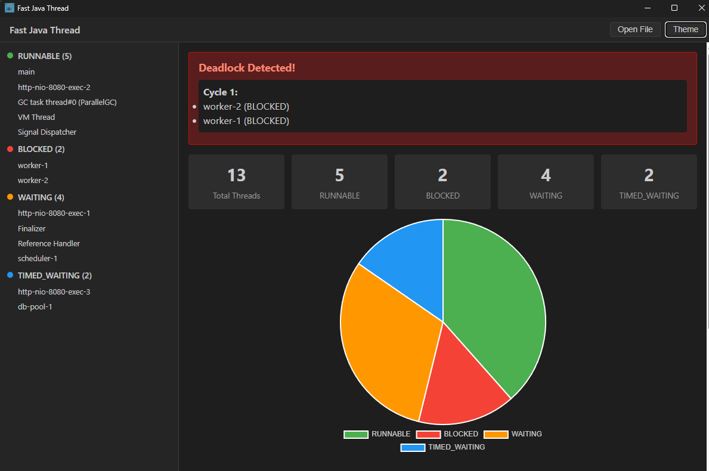

# Fast Java Thread

[](https://github.com/martin5211/FastJavaThread-app/actions/workflows/release.yml)

Cross-platform desktop application for analyzing Java thread dumps. Built with [Tauri v2](https://v2.tauri.app/) and TypeScript.

## Download

Pre-built binaries for Windows, macOS, and Linux are available on the [Releases](https://github.com/martin5211/FastJavaThread-app/releases) page.

## Features

- Open thread dump files (`.tdump`, `.txt`, `.log`) or drag-and-drop
- Thread state distribution chart (pie chart)
- Hot methods analysis
- Deadlock detection with cycle visualization
- Collapsible sidebar grouped by thread state
- Thread detail view with full stack trace
- Dark / Light theme toggle
- MCP server with 5 analysis tools for AI assistant integration
- Configurable MCP settings (transport, port, authentication)
- Fully offline — no network access, no telemetry

## Screenshots



## MCP Integration

The app includes a built-in [Model Context Protocol](https://modelcontextprotocol.io/) server that lets AI assistants analyze thread dumps directly.

### Available tools

| Tool | Description |
|------|-------------|
| `analyze_thread_dump` | Full analysis: thread states, hot methods, deadlocks |
| `detect_deadlocks` | Find deadlock cycles with lock chain details |
| `get_hot_methods` | Most frequent methods across all stack traces |
| `get_thread_summary` | Thread count, state breakdown, JVM version |
| `find_threads_by_method` | Search threads by method name or regex |

### Usage

1. Click the **MCP** button in the toolbar to start the server
2. Configure transport and port in **Settings** (gear icon)
3. Connect your MCP client (e.g. Claude Code) to `localhost:3100` (HTTP) or via stdio

For stdio mode, run the server directly:

```bash
npm run mcp:build
node lib/FastJavaThread/out/src/mcp/server.js
```

> **Note:** MCP server requires [Node.js 20+](https://nodejs.org/) installed on your machine.

## Prerequisites

### Windows
- [Microsoft Visual Studio C++ Build Tools](https://visualstudio.microsoft.com/visual-cpp-build-tools/)
- WebView2 (pre-installed on Windows 10+)
- [Rust](https://rustup.rs/)
- [Node.js 20+](https://nodejs.org/)

### macOS
- Xcode Command Line Tools (`xcode-select --install`)
- [Rust](https://rustup.rs/)
- [Node.js 20+](https://nodejs.org/)

### Linux
- System packages:
  ```bash
  sudo apt install libwebkit2gtk-4.1-dev libgtk-3-dev libappindicator3-dev librsvg2-dev patchelf
  ```
- [Rust](https://rustup.rs/)
- [Node.js 20+](https://nodejs.org/)

## Getting Started

```bash
git clone --recurse-submodules https://github.com/martin5211/FastJavaThread-app.git
cd FastJavaThread-app
npm install
npm run dev        # development mode with hot reload
npm run build      # production build
npm test           # run tests
```

## Build Output

| Platform | Artifacts |
|----------|-----------|
| Windows  | `src-tauri/target/release/bundle/msi/*.msi`, `src-tauri/target/release/bundle/nsis/*.exe` |
| macOS    | `src-tauri/target/release/bundle/dmg/*.dmg` |
| Linux    | `src-tauri/target/release/bundle/deb/*.deb`, `src-tauri/target/release/bundle/appimage/*.AppImage` |

## Architecture

The core parsing logic lives in the [FastJavaThread](https://github.com/martin5211/FastJavaThread) git submodule at `lib/FastJavaThread/`. The desktop app imports directly from the submodule.

## License

[Eclipse Public License - v 2.0](LICENSE)
